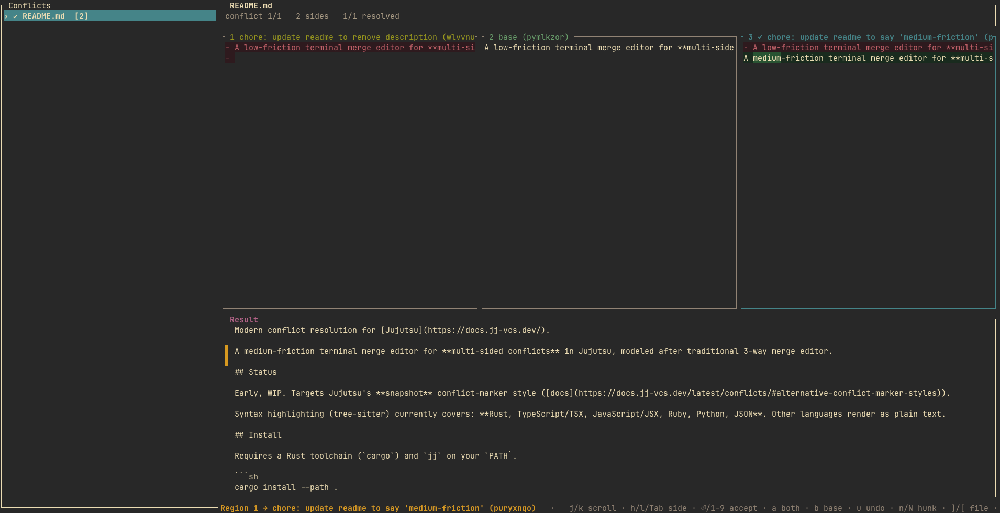
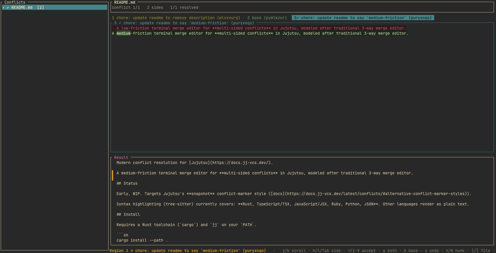

# jj-yield

Modern conflict resolution for [Jujutsu](https://docs.jj-vcs.dev/).

A low-friction terminal merge editor for **multi-sided conflicts** in Jujutsu, modeled after traditional 3-way merge editor.




## Status

Early, WIP. Targets Jujutsu's **snapshot** conflict-marker style ([docs](https://docs.jj-vcs.dev/latest/conflicts/#alternative-conflict-marker-styles)).

Syntax highlighting (tree-sitter) currently covers: **Rust, TypeScript/TSX, JavaScript/JSX, Ruby, Python, JSON**. Other languages render as plain text.

## Install

Requires a Rust toolchain (`cargo`) and `jj` on your `PATH`.

```sh
cargo install --path .
# or, while developing:
cargo run
```

## Usage

Run it from inside a Jujutsu repo that has unresolved conflicts:

```sh
jj-yield
```

`jj-yield` reads the conflict list with `jj resolve --list` and materializes each file with `jj file show` (forcing snapshot markers via `--config ui.conflict-marker-style=snapshot`, so it works regardless of your config). Accepting a side and writing replaces that conflict region's markers with the chosen content; jj re-evaluates the conflict on its next snapshot.

The **Result** pane is a live preview of the file you're assembling: accepted regions show resolved content, unresolved regions show their conflict markers (in red), and the current region is marked in the gutter.

### Keybindings

| Key | Action |
| --- | --- |
| `j` / `k`, `↑` / `↓` | scroll the side panes |
| `Ctrl-d` / `Ctrl-u` | half-page scroll |
| `gg` / `G` | top / bottom |
| `h` / `l`, `Tab` / `Shift-Tab` | focus previous / next side |
| `m` | toggle side-by-side ↔ tabbed |
| `n` / `N` | next / previous conflict region |
| `]` / `[` (or `J` / `K`) | next / previous file |
| `⏎` | accept the focused side |
| `1`–`9` | accept a side by number |
| `a` | accept both sides (in order) |
| `b` | accept the base |
| `u` | un-resolve the current region |
| `w` | write resolution(s) to disk |
| `e` | open the file in `$EDITOR` |
| `r` | refresh from jj |
| `?` | toggle help |
| `q` / `Esc` / `Ctrl-c` | quit |

## Development

```sh
cargo test     # parser + diff + highlighter + render tests
cargo run      # launch against the current repo's conflicts
```

Parser/diff fixtures live in `tests/fixtures/` (captured from real `jj` output). See `CLAUDE.md` for architecture, the snapshot grammar, and how to add a language.

## AI-Assisted Coding Disclosure

I do not know how to code in rust. Yet, this project is written in nearly 100% rust. In fact, I've barely reviewed much of this code at this point in the project's lifecycle. That's right, I vibe-coded this project. Over the last year, I've gone crazy trying to determine if something is "AI generated" and being passed off as some original work, to somehow determine how genuine or deceptive a developer is being. So this disclaimer serves as my way to be fully transparent: this project is vibe-coded in the purest sense.

I needed a better tool than I could find out there, and I needed it quicker than I could build myself using any stack I knew. I *also* have a desire to learn Rust, and I have heard good things about it, so I decided to vibe-code an initial scaffold and MVP for the tool in rust. It turned out pretty good if I'm honest. It is nearly exactly what I have been looking for since switching to Jujutsu. So, regardless of your thoughts on AI-assisted coding, my hope is that at the very least, this project's existence, however vibe-coded, means you don't need to impact the environment any more than I did to create this.

Going forward, I plan on leveraging AI-assisted coding less and less as I learn. However, for this project, if I'm choosing between a *great* feature **now** and a *fine* feature after **weeks** of learning, iteration, and tedium, I'll choose to use AI-assistance. I simply don't have the time at this point in my life to do all I want to do, and this project isn't a high priority at this point.

If you **DO** know rust, contributions are always open. Leave an issue, open a PR, reach out to me, whatever! I'd love to learn from you!
